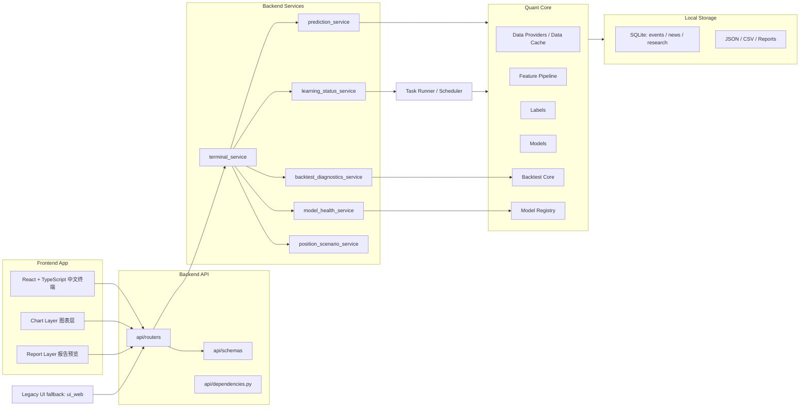

# SNInsightTerminal 专业终端架构设计

本文档用于规划下一阶段专业前后端终端重构。当前阶段只做设计，不删除旧 UI，不破坏现有 API，不重写量化核心。

## 1. 当前结构扫描结果

### 1.1 后端入口

- 桌面启动入口：[app_launcher.py](../app_launcher.py)
- 本地 API 入口：[src/sn_futures/api_server.py](../src/sn_futures/api_server.py)
- API server 当前使用 `http.server.ThreadingHTTPServer` 与 `BaseHTTPRequestHandler`，不是 FastAPI。
- 服务启动函数为 `run_api_server(host="127.0.0.1", port=8765)`。
- 后台任务、自动调度、worker 子进程和静态资源服务目前集中在 `api_server.py`。

### 1.2 API 聚合层

- 主兼容聚合文件：[src/sn_futures/v2_api.py](../src/sn_futures/v2_api.py)
- 主要职责：
  - 保持旧 endpoint 兼容。
  - 聚合预测、图表、新闻事件、模型健康、学习状态、报告、持仓情景等 payload。
  - 调用新 service 层输出中文业务字段。
- 当前存在重复定义遗留风险，例如 `get_models_health` / `get_model_promotion_report` 兼容覆盖，需要后续拆分到 router/service 后保留兼容外壳。

### 1.3 Services 目录职责

目录：[src/sn_futures/services/](../src/sn_futures/services)

- `prediction_service.py`：预测卡片中文化、数据质量降级、观望交易点位清空。
- `model_health_service.py`：模型健康与治理状态聚合。
- `learning_status_service.py`：学习、训练、walk-forward、事件消融和下一任务状态。
- `backtest_diagnostics_service.py`：回测诊断、成本后指标和 promotion 结论。
- `position_scenario_service.py`：持仓情景观察区与风险区。
- `report_service.py`：中文报告内容聚合。
- `payload_utils.py`：缺失值、中文标签、JSON 安全和合规文案工具。

### 1.4 当前静态文件服务方式

- 静态目录：[ui_web/](../ui_web)
- 文件：
  - [ui_web/index.html](../ui_web/index.html)
  - [ui_web/app.js](../ui_web/app.js)
  - [ui_web/styles.css](../ui_web/styles.css)
- `api_server.py` 中 `_web_root()` 指向 `ui_web`。
- `/` 与 `/terminal` 当前返回 `index.html`。
- 旧 UI 是无构建依赖的静态页面，不能删除，应作为 legacy fallback 保留。

### 1.5 模板系统

- 当前没有独立模板系统。
- 报告以 Markdown / HTML 字符串输出为主。
- 后续可新增 `templates/` 存放报告模板和静态 shell 模板，但不应影响现有报告接口。

### 1.6 WebSocket / SSE

- 当前未发现 WebSocket、SSE 或 EventSource 实现。
- 当前实时性依赖前端 polling、后端后台任务与调度状态。
- 下一阶段优先继续使用 polling，稳定后再扩展 SSE 或 WebSocket。

### 1.7 本地存储与状态

- SQLite：
  - `app_data/data/event_store.sqlite`
  - `app_data/data/news_events.sqlite`
  - `research_v2.py` 也包含研究数据库能力。
- JSON / CSV 状态：
  - `app_data/cache/rate_limit_state.json`
  - `app_data/outputs/sn_live_predictions.json`
  - `app_data/outputs/sn_unified_forecast.json`
  - `app_data/outputs/sn_scheduler_state.json`
  - `app_data/outputs/sn_predictions.csv`
  - `app_data/outputs/sn_prediction_baseline.csv`
- 报告输出：
  - `app_data/outputs/reports/`

### 1.8 当前测试结构

- 测试目录：[tests/](../tests)
- 当前覆盖范围：
  - API/报告/UI 集成
  - 数据源与数据质量
  - 因子工程
  - 标签与 leakage guard
  - 模型框架
  - 回测核心
  - 治理 gate
  - URL 安全与事件链路
  - 预测路径与多周期隔离
  - Web 静态合同
- 当前基线：`pytest -q` 97 passed，`unittest` 97 OK。

### 1.9 打包与发行脚本

- 打包脚本：[packaging/build_windows_package.ps1](../packaging/build_windows_package.ps1)
- PyInstaller spec：
  - `packaging/SNInsightTerminal.spec`
  - `packaging/SNInsightTerminalApp.spec`
  - `packaging/SNInsightTerminalAppGpu.spec`
  - `packaging/SNInsightTerminalSetup.spec`
- 安装器脚本：
  - `packaging/installer/`
- 发行目录：
  - `release/`
  - `release_archive/`

## 2. 目标总体架构



核心原则：

- Backend API 只做 HTTP、认证边界、schema 和错误格式。
- Backend Services 做业务聚合，不直接写前端格式。
- Quant Core 保持当前已验证的模块，不因前端重构而重写。
- Local Storage 统一管理 SQLite、JSON、CSV、报告和缓存。
- Frontend App 只渲染后端真实 payload，不生成假概率、假预测或假交易点位。
- Legacy UI fallback 保留旧入口，直到新终端完成验收。

## 3. 后端建议目录

建议逐步新增，不一次性搬迁：

```text
src/sn_futures/
  api/
    __init__.py
    dependencies.py
    routers/
      __init__.py
      terminal.py
      predictions.py
      charts.py
      events.py
      models.py
      learning.py
      backtest.py
      reports.py
      position.py
      system.py
    schemas/
      __init__.py
      common.py
      terminal.py
      prediction.py
      chart.py
      event.py
      model.py
      learning.py
      backtest.py
      report.py
      position.py
  services/
    ...
  terminal/
    __init__.py
    terminal_service.py
    summary_builder.py
    snapshot_builder.py
    navigation.py
  tasks/
    __init__.py
    task_runner.py
    task_store.py
    scheduler.py
  storage/
    __init__.py
    paths.py
    sqlite.py
    json_store.py
    cache_store.py
  static/
    legacy/
    terminal/
  templates/
    reports/
```

迁移策略：

- 第一阶段只新增 `api/schemas` 与 `api/routers`，内部调用现有 `v2_api.py` 和 `services`。
- 第二阶段将 `api_server.py` 从手写 path 分发改为 router 映射或 FastAPI。
- 第三阶段把 `v2_api.py` 收敛为兼容层，不再新增业务逻辑。

## 4. 前端建议目录

新增目录为 `frontend/`，不要覆盖 `ui_web/`：

```text
frontend/
  package.json
  vite.config.ts
  tsconfig.json
  index.html
  src/
    main.tsx
    App.tsx
    api/
      client.ts
      terminal.ts
      predictions.ts
      charts.ts
      events.ts
      models.ts
      learning.ts
      reports.ts
      position.ts
    components/
      layout/
      cards/
      tables/
      status/
      forms/
      disclosure/
      error-boundary/
    pages/
      OverviewPage.tsx
      PredictionPage.tsx
      FactorPage.tsx
      EventMonitorPage.tsx
      BacktestPage.tsx
      ModelGovernancePage.tsx
      PositionScenarioPage.tsx
      ReportCenterPage.tsx
      DataStatusPage.tsx
      SettingsPage.tsx
      TechnicalDetailsPage.tsx
    charts/
      PriceForecastChart.tsx
      ProbabilityPathChart.tsx
      IntervalWidthChart.tsx
      FactorHeatmap.tsx
      BacktestEquityChart.tsx
      EventTimeline.tsx
    hooks/
      usePolling.ts
      useTaskStatus.ts
      useTerminalSnapshot.ts
      useHorizonSelection.ts
    types/
      api.ts
      prediction.ts
      event.ts
      model.ts
      backtest.ts
      position.ts
    utils/
      labels.ts
      format.ts
      guards.ts
      missing.ts
    styles/
      tokens.css
      layout.css
      terminal.css
```

推荐技术：

- Vite + React + TypeScript。
- 图表层优先 ECharts 或轻量 SVG fallback。
- 数据请求使用封装 `fetch` client，统一处理超时、错误和缺失字段。
- 不在前端保存或输入 API key。

## 5. 前端页面设计

### 5.1 总览大盘

展示：

- 最新沪锡主力合约、实时价、行情时间、系统刷新时间。
- 七周期方向矩阵。
- 数据质量、模型状态、事件状态、任务状态。
- 合规免责声明固定可见。

### 5.2 七周期预测

展示：

- 5分钟、15分钟、30分钟、1小时、1日、1-2周、1-3个月。
- 方向、概率、信号强弱、置信度、价格中枢、区间。
- 决策说明、核心因子、事件依据、路径守门和风险提示。
- 观望时显示“暂无交易点位”。

### 5.3 因子分析

展示：

- 技术面、均值回归、期限结构、基差、库存、跨市场、事件、regime。
- 缺失字段中文说明。
- 因子 IC、覆盖率、稳定性、分 regime 表现。

### 5.4 事件监控

展示：

- 入模事件、过滤事件、过滤原因。
- 利多、利空、波动风险事件。
- 新闻/政策原文链接。
- 事件 `available_at` 和是否进入模型。

### 5.5 回测与 Walk-forward

展示：

- walk-forward 窗口、成本后指标、baseline 对比。
- 方向命中、强信号命中、Brier、ECE、MAE、RMSE、区间覆盖。
- 成本敏感性、regime 分组、signal strength 分组。

### 5.6 模型治理

展示：

- active / candidate / degraded / retired。
- promotion gate 条件和中文失败原因。
- degradation gate 状态。
- 模型版本、特征版本、标签版本、训练窗口和测试窗口。

### 5.7 持仓情景

输入：

- 持仓方向、手数、均价、账户权益、最大可承受亏损、计划周期。

输出：

- 名义敞口、保证金占用、VaR、压力 VaR。
- 观察区、风险区、周期共振、事件依据、不确定性提示。
- 禁止确定性买卖建议。

### 5.8 报告中心

展示：

- 日报、周报、月报、事件报告。
- 数据截止时间、模型版本、promotion gate 状态、成本后回测指标。
- 合规声明。

### 5.9 数据源状态

展示：

- AkShare、Sina、Alpha Vantage、NewsAPI、SHFE、事件库等状态。
- 最近成功时间、失败原因、缓存状态、限流状态。

### 5.10 系统设置

展示：

- 本地运行状态、端口、数据目录、缓存目录、build_id。
- API key 配置只通过后端设置或环境变量，不进入前端 bundle。

### 5.11 技术明细

展示：

- 原始 API payload、feature hash、cache key、diagnostics。
- 默认折叠，仅用于开发调试。

## 6. UI 设计原则

- 全中文。
- 普通用户视角优先。
- 风险提示显著。
- 数据质量不足时降级显示。
- 观望不显示交易点位。
- degraded 模型不显示交易点位。
- 技术明细默认折叠。
- 深色专业终端风格。
- 响应式布局，1080P 与 125% 缩放下可完整滚动。
- 图表可交互，支持缩放、悬浮、切换周期。
- 合规免责声明固定可见。
- 不显示英文调试文案。
- 某个模块失败不导致整页白屏。

## 7. Terminal API 合同设计

新增 API 不替代旧 API，先作为聚合层：

### GET `/api/terminal/summary`

用途：顶部状态栏和总览摘要。

返回：

- build_id、pid、api_port、data_dir、cache_dir。
- 最新行情、主力合约、数据年龄。
- active model 概览。
- 最近任务状态。
- 合规声明。

### GET `/api/terminal/snapshot`

用途：首页一次性快照。

返回：

- summary
- predictions
- model_health
- learning_status
- data_status
- event_summary
- system_health

### GET `/api/terminal/predictions`

用途：七周期预测卡和方向矩阵。

返回：

- 每周期中文业务字段。
- 决策说明、核心因子、事件依据、风险提示。
- 数据质量、模型状态、路径守门。

### GET `/api/terminal/model-health`

用途：模型健康页。

返回：

- active / candidate / degraded。
- 方向命中、高置信命中、Brier、ECE、MAE、RMSE、区间覆盖、成本后收益。
- promotion / degradation 结论。

### GET `/api/terminal/learning-status`

用途：学习与任务状态。

返回：

- 最近行情刷新、最近预测、最近验证、最近校准。
- 最近候选训练、walk-forward、事件消融、promotion check。
- 下一次任务、失败原因。

### GET `/api/terminal/backtest-diagnostics`

用途：回测诊断页。

参数：

- `horizon`

返回：

- walk-forward 指标。
- baseline 对比。
- 成本敏感性。
- regime 分组表现。
- signal strength 分组表现。
- promotion gate 结论。

### POST `/api/terminal/position-scenario`

用途：持仓情景。

输入：

- 方向、手数、均价、账户权益、最大可承受亏损、计划周期。

返回：

- 观察区、风险区、VaR、压力 VaR、周期共振、事件依据、合规提示。

### GET `/api/terminal/reports`

用途：报告中心。

参数：

- `type=daily|weekly|monthly|event`

返回：

- markdown、html、生成时间、数据截止时间、合规声明。

### GET `/api/terminal/data-status`

用途：数据源状态页。

返回：

- provider status。
- rate limit。
- cache status。
- data quality。
- stale/fallback 状态。

### GET `/api/terminal/system-health`

用途：系统健康与审计页。

返回：

- runtime status。
- system truth audit。
- model independence audit。
- forecast path audit。
- data reality audit。
- latency audit。

## 8. 实时更新设计

第一阶段采用 polling：

- 顶部 summary：15-30 秒。
- 行情/预测 snapshot：交易时段 15-60 秒，非交易时段 3-5 分钟。
- 任务状态：任务运行中 1-2 秒，完成后降频。
- 新闻事件：5-15 分钟。
- 模型健康、回测、报告：手动刷新或任务完成后刷新。

后续可扩展：

- SSE：任务进度、行情刷新、事件入库通知。
- WebSocket：仅在需要多页面实时同步时启用。

原则：

- 不为了实时性牺牲稳定性。
- 前端模块级错误隔离，某个 API 失败不导致白屏。
- 失败时展示“保留上一次成功数据”。

## 9. 数据安全设计

- API key 只在后端环境变量或本地安全配置中读取。
- 前端不展示、不输入、不保存 key。
- 后端日志必须脱敏，不打印完整 key。
- 前端 bundle 不包含 key、路径密钥或本地敏感配置。
- 错误信息不泄露完整本机路径、key、token 或连接串。
- 原文链接打开使用后端安全 URL 校验，禁止 `file:`、`javascript:`、`data:`、localhost 和内网 IP。

## 10. 迁移策略

### Phase A：保留旧 UI，新增 `frontend/`

- 新建 Vite React TypeScript 项目。
- 不修改 `ui_web/index.html`。
- 新终端本地开发使用 Vite dev server。

### Phase B：新增 terminal API 聚合

- 新增 `/api/terminal/*`。
- 内部复用现有 `v2_api.py` 和 service 层。
- 增加 schema 与测试。

### Phase C：前端接入真实 terminal API

- 七周期预测、模型健康、学习状态、持仓情景、报告中心全部接真实 API。
- 不使用 mock 数据冒充生产结果。

### Phase D：frontend build 后由后端静态服务

- `frontend/dist` 构建产物复制到 `src/sn_futures/static/terminal/` 或打包资源目录。
- `/terminal` 指向新终端。
- `/legacy` 指向旧 `ui_web`。

### Phase E：旧 UI 标记为 legacy

- 旧 UI 仅用于回退。
- README 标明新旧入口。

### Phase F：最终切换默认入口

- 新终端通过验收后，`/` 默认进入新终端。
- `/legacy` 保留一个版本周期。
- 打包 smoke 覆盖新终端和 legacy fallback。

## 11. 风险控制

- 不接实盘交易接口。
- 不承诺收益。
- 不显示确定性买卖建议。
- 只显示研究观察、观望、风险提示和情景观察区。
- 预测卡片必须展示数据质量和模型状态。
- candidate 未通过 promotion gate 不得显示为 active。
- degraded 模型不得输出交易点位。
- 数据质量不足时必须降级显示。

## 12. 关键风险点

- 当前 `api_server.py` 职责过多，迁移时应先新增 router，不要一次性改掉启动入口。
- 当前 `v2_api.py` 仍承担兼容与聚合职责，后续需要逐步瘦身。
- 前端工程化会引入 Node 依赖，需要新增构建、lint、typecheck 与打包路径。
- 静态资源打包必须兼容 PyInstaller。
- 新终端不能重新引入前端假概率或缺字段兜底。
- 需要保持现有 97 个测试不回退。

## 13. 结论

建议进入 Prompt 11：后端 terminal API 和 schema 重构。该阶段风险最低，可以先在不影响旧 API 的前提下建立 `/api/terminal/*` 聚合接口，为 React 前端提供稳定合同。

## 14. Prompt 11 后端 Terminal API 实施结果

本阶段已在不迁移 FastAPI、不删除旧 endpoint、不删除旧 UI 的前提下，新增专业终端后端聚合层。

### 14.1 新增文件

- `src/sn_futures/api/__init__.py`
- `src/sn_futures/api/schemas.py`
- `src/sn_futures/api/json_utils.py`
- `src/sn_futures/api/terminal_api.py`
- `src/sn_futures/services/terminal_service.py`
- `tests/test_terminal_api.py`

### 14.2 新增 endpoint

当前仍由 `src/sn_futures/api_server.py` 的 `ThreadingHTTPServer + BaseHTTPRequestHandler` 分发，新增以下路径：

- `GET /api/terminal/docs`
- `GET /api/terminal/summary`
- `GET /api/terminal/snapshot`
- `GET /api/terminal/predictions`
- `GET /api/terminal/model-health`
- `GET /api/terminal/learning-status`
- `GET /api/terminal/backtest-diagnostics`
- `POST /api/terminal/position-scenario`
- `GET /api/terminal/reports`
- `GET /api/terminal/data-status`
- `GET /api/terminal/system-health`

旧 API 不变，旧前端仍由 `ui_web/` 提供。

### 14.3 Schema 设计

`src/sn_futures/api/schemas.py` 使用 dataclass 定义稳定结构，避免为了本轮改造新增破坏性依赖。主要 schema 包括：

- `TerminalSummary`
- `PredictionCard`
- `ModelHealth`
- `LearningStatus`
- `BacktestDiagnostics`
- `PositionScenario`
- `DataSourceStatus`
- `SystemHealth`

后续如果迁移 FastAPI，可将这些 dataclass 平滑替换或映射为 Pydantic model。

### 14.4 JSON 清洗策略

`src/sn_futures/api/json_utils.py` 提供：

- `sanitize_for_json`
- `ensure_no_non_finite`
- `safe_json_dumps`
- `clean_trade_points`

策略：

- `NaN / Infinity / -Infinity` 转为 `None` 或中文缺失状态。
- numpy / pandas 标量、datetime/date 可安全序列化。
- 敏感字段如 `api_key`、`token`、`password`、`secret`、`credential` 自动脱敏。
- 观望、degraded、低数据质量、edge <= 0 时清空 `entry / stop_loss / take_profit`。
- `safe_json_dumps` 使用 `allow_nan=False`。

### 14.5 与旧 `v2_api.py` 的兼容策略

`terminal_service.py` 不复制量化核心逻辑，只聚合现有 `v2_api.py` 和 `services/` 输出：

- 预测来自现有 `get_live_predictions`。
- 模型健康来自现有 `get_models_health`。
- 学习状态来自现有 `get_learning_status`。
- 回测诊断来自现有 `get_backtest_diagnostics`。
- 持仓情景复用现有 `evaluate_position_scenario_api`。
- 报告复用现有 `get_report_content`。

任何单个模块报错时，terminal service 会返回中文错误状态，避免整个 snapshot 崩溃。

### 14.6 未来迁移 FastAPI 的可选路线

本轮不迁移 FastAPI。未来可按以下顺序迁移：

1. 保持 `handle_terminal_api` 和 schema 不变。
2. 新增 FastAPI app，仅挂载 `/api/terminal/*`。
3. 保留当前 `ThreadingHTTPServer` 作为 legacy backend。
4. 完成测试后再统一后端入口。

这样可以降低一次性替换服务框架造成的发行风险。

## 15. Prompt 12 前端实施结果

本阶段新增独立专业前端目录 `frontend/`，不删除旧 `ui_web/`，不覆盖旧 `index.html`，不改后端服务框架。新前端用于下一阶段 `/terminal` 静态托管，当前通过 Vite 开发服务器访问。

### 15.1 新增 frontend 目录

- `frontend/package.json`：Vite + React + TypeScript 脚本与依赖。
- `frontend/vite.config.ts`：React plugin、`/api` 代理到 `http://127.0.0.1:8765`、默认 base `/terminal/`。
- `frontend/tsconfig.json` / `frontend/tsconfig.node.json`：TypeScript 构建配置。
- `frontend/index.html`：新终端挂载入口。
- `frontend/src/main.tsx` / `frontend/src/App.tsx`：应用入口、页面切换和全局错误隔离。

### 15.2 页面设计

新前端已按专业终端信息架构创建页面：

- 总览大盘
- 七周期预测
- 因子分析
- 事件监控
- 回测与 Walk-forward
- 模型治理
- 持仓情景
- 报告中心
- 数据源状态
- 系统设置

所有普通用户可见文案默认中文。技术 JSON、原始 payload 与开发调试信息只放入“技术明细 / 开发调试信息”折叠区。

### 15.3 组件设计

主要组件目录：

- `components/layout/`：终端外壳、侧栏、顶部状态栏、通用区块卡片。
- `components/prediction/`：七周期预测卡、信号标签、风险标签。
- `components/charts/`：概率仪表、价格区间、权益曲线、回撤和因子图表。
- `components/model/`：模型健康、晋级门槛、学习状态。
- `components/backtest/`：walk-forward、成本敏感性和 regime 表现。
- `components/position/`：持仓情景输入与结果。
- `components/reports/`：报告中心。
- `components/data/`：数据源状态。
- `components/common/`：加载、错误、空状态、指标卡和折叠调试。

### 15.4 API Client

前端只调用 `/api/terminal/*`：

- `getTerminalSnapshot`
- `getPredictions`
- `getModelHealth`
- `getLearningStatus`
- `getBacktestDiagnostics`
- `postPositionScenario`
- `getReports`
- `getDataStatus`
- `getSystemHealth`

不直接调用旧 `/api/predictions/live`，避免绕过 terminal 聚合合同。API base 优先读取 `VITE_API_BASE_URL`，否则使用当前 origin。

### 15.5 构建方式

开发：

```powershell
cd frontend
npm install
npm run dev
```

类型检查与构建：

```powershell
cd frontend
npm run typecheck
npm run build
```

### 15.6 与旧 UI 的关系

- 旧 UI：继续保留在 `ui_web/`，当前仍可作为 legacy fallback。
- 新 UI：位于 `frontend/`，下一阶段由后端托管 `frontend/dist` 到 `/terminal`。
- 后续计划：`/legacy` 指向旧 UI，`/terminal` 指向新终端，最终验收后再考虑默认入口切换。

### 15.7 安全与合规

- 前端不输入、不保存、不展示 API key。
- 前端 bundle 不包含 `SN_ALPHA_VANTAGE_KEY` 或 `SN_NEWSAPI_KEY` 的值。
- 持仓情景只显示观察区、风险区和不确定性提示，不提供确定性买卖指令。
- 固定显示合规声明：“仅供沪锡期货量化投研参考，不构成投资建议，不承诺收益，不接实盘交易。”

## 16. Prompt 13 前后端联调与静态托管实施结果

本阶段在不替换 `ThreadingHTTPServer`、不删除旧 UI、不中断旧 API 的前提下，新增新专业终端的本地静态托管入口。

### 16.1 `/terminal` 托管设计

- `/terminal` 与 `/terminal/` 指向 `frontend/dist/index.html`。
- `/terminal/assets/...`、`/terminal/*.js`、`/terminal/*.css` 等静态资源从 `frontend/dist/` 安全读取。
- 若资源不存在但 `index.html` 存在，则按前端 history route 返回 `index.html`。
- 若 `frontend/dist/index.html` 不存在，则返回中文提示页，说明专业前端尚未构建，并提供：
  - Terminal API 文档：`/api/terminal/docs`
  - 旧版终端：`/legacy`

### 16.2 `/legacy` 旧 UI 设计

- `/legacy` 与 `/legacy/` 指向旧 `ui_web/index.html`。
- `/legacy/app.js`、`/legacy/styles.css` 等资源继续从 `ui_web/` 读取。
- `/` 当前行为保持不变，本阶段不把默认入口切到新终端。

### 16.3 静态资源安全

静态托管层新增了路径安全检查：

- 禁止 `..` 路径穿越。
- 仅允许读取 `frontend/dist` 与 `ui_web` 目录内资源。
- 终端静态资源 403/404 响应不暴露本机绝对路径。
- MIME 类型覆盖 `html/js/css/json/svg/png/ico/woff/woff2`。
- 不读取、不打印、不返回 API key。

### 16.4 Windows 脚本

新增脚本：

- `scripts/start_backend.ps1`：启动后端并显示 `/terminal`、`/legacy`、`/api/terminal/docs`。
- `scripts/start_frontend_dev.ps1`：检查 Node/npm，安装依赖并启动 Vite dev server。
- `scripts/build_frontend.ps1`：检查 Node/npm，执行 typecheck 与 build，生成 `frontend/dist`。
- `scripts/start_terminal.ps1`：给出推荐启动顺序，不强行同时拉起多个进程。

### 16.5 Vite proxy

`frontend/vite.config.ts` 当前配置：

- `base: "/terminal/"`
- `build.outDir: "dist"`
- dev server `host: "127.0.0.1"`、`port: 5173`
- `/api` 代理到 `http://127.0.0.1:8765`
- 支持 `VITE_API_BASE_URL`，但默认前端仍使用同源 `/api`

### 16.6 当前 Node/npm 环境限制

当前 Codex 运行环境中 `node.exe` 返回 `Access is denied`，`npm` 不可用，因此本阶段无法在该环境执行前端 `npm install/typecheck/build`。这不影响 Python 后端测试；在用户本机具备 Node.js LTS 的环境中可运行 `scripts/build_frontend.ps1` 生成 `frontend/dist`。

### 16.7 下一步 Prompt 14 验收项

- 使用真实 Node/npm 环境构建 `frontend/dist`。
- 验证 `/terminal` 新终端页面可加载、刷新、切换模块。
- 验证 `/legacy` 旧 UI 仍可用。
- 验证 PyInstaller 或安装包包含 `frontend/dist`。
- 做 UI 中文检查、key 泄露检查、NaN 检查、观望/降级交易点位检查。

## Prompt 26：图表、新闻、报告与因子诊断 API 实施结果

本阶段在不改模型、回测和数据核心的前提下，为专业终端补齐用于展示真实运行期数据的聚合 API。新增接口仍基于现有 `ThreadingHTTPServer` 与 `/api/terminal/*` 分发，不迁移框架。

### 新增展示接口

- `GET /api/terminal/charts/price-history`：行情历史图表数据，数据源为 `outputs/sn_market_history.json`、`outputs/sn_live_snapshot.json`，必要时回退到现有 chart payload。
- `GET /api/terminal/charts/forecast-path`：预测路径图表数据，数据源为 `outputs/sn_unified_forecast.json` 或 `outputs/sn_live_predictions.json`。
- `GET /api/terminal/charts/equity-curve`：回测权益曲线数据；无回测产物时返回空数组和中文说明。
- `GET /api/terminal/charts/drawdown`：回撤数据；无回测产物时返回空数组和中文说明。
- `GET /api/terminal/events/news`：新闻事件列表和 provider 状态，数据源为 `outputs/events/news_events.json`、`event_store.json`、`provider_status.json`。
- `GET /api/terminal/events/evidence?horizon=...`：周期事件证据，优先读取 `outputs/events/event_evidence_by_horizon.json`。
- `GET /api/terminal/reports/full?type=daily|weekly|monthly|event`：报告 Markdown 全文，数据源为用户报告目录中的 `sn_daily_report.md` 等文件。
- `GET /api/terminal/factors/diagnostics`：因子诊断分组，读取 `sn_factor_diagnostics.json/csv` 或 `factor_diagnostics.json/csv`。

### 无数据降级策略

所有展示接口都必须返回稳定 JSON：没有真实数据时返回空数组或空 Markdown，并用中文 `message_zh` 解释下一步。系统不会为了填充页面而生成假行情、假新闻、伪预测路径或伪回测指标。

### 与前端的关系

下一轮前端接入时，图表组件应优先调用上述专门 API，而不是从预测卡片中自行推导历史行情、预测路径、报告正文或新闻事件。
